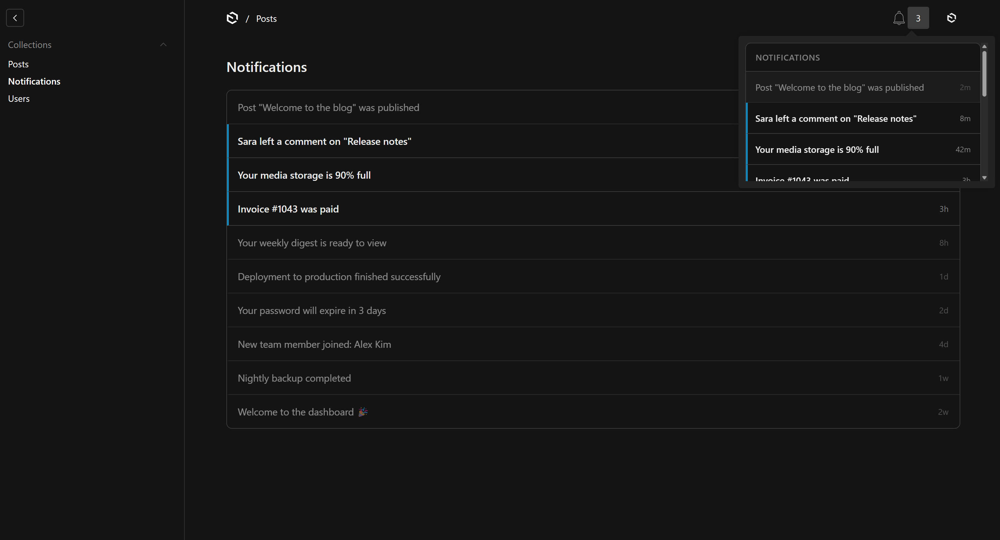
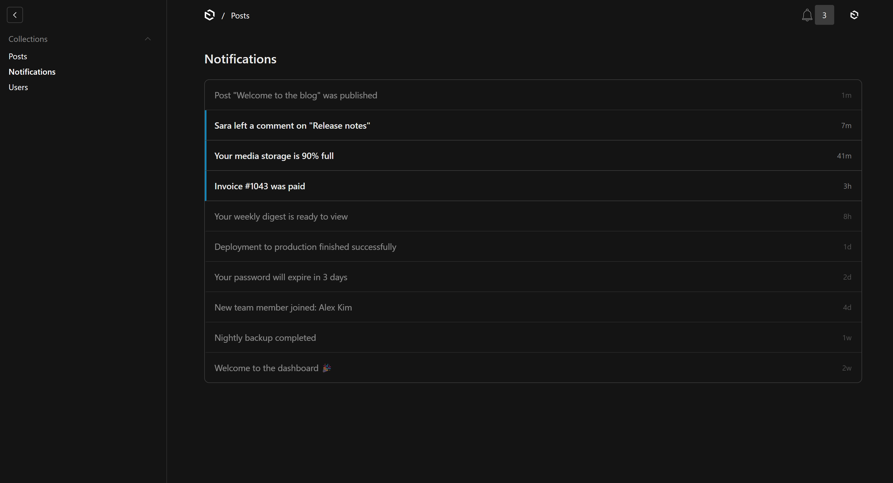

# @elghaied/payload-plugin-notifications

[](https://www.npmjs.com/package/@elghaied/payload-plugin-notifications)
[](https://www.npmjs.com/package/@elghaied/payload-plugin-notifications)
[](./LICENSE)

In-dashboard notifications for the [Payload](https://payloadcms.com) admin, with a **live bell**
that updates without a page refresh.

- 🔔 A `NotificationBell` in the admin header — unread count + dropdown feed with compact relative
  timestamps ("now", "40m", "2d"); unread rows highlighted, read rows dimmed; click a row to mark
  it read and go where it points.
- 📋 A **custom notifications list view** — Payload's default table is replaced with a clean,
  paginated feed (same row, whole-row click marks read + navigates). Reached via "See all".
- ⚡ **Live** via Server-Sent Events (best-effort), with graceful degradation when SSE can't connect.
- 🗄️ Every notification is a real DB row (the source of truth) — **adapter-agnostic** (Mongo or Postgres), opaque ids.
- 🔒 Notification `link`s are scheme-validated before navigation (no `javascript:`/`data:` XSS).
- 🌍 **Translated** UI strings, field labels, and collection labels — ships 12 languages (`ar`, `de`, `en`, `es`, `fr`, `hi`, `id`, `it`, `pl`, `ru`, `tr`, `zh`), RTL-aware; user translations override.
- 🧩 Additive and **default-off**; **optional** multi-tenant scoping.

## Screenshots

| Bell dropdown | Custom list view |
|---|---|
|  |  |

Unread rows carry an accent bar and bolded text; read rows are dimmed. Times are compact and relative (`now`, `8m`, `3h`, `2d`, `1w`), with the full timestamp on hover.

## How it works

Two decoupled layers:

1. **Source of truth** — a `notifications` collection row. Created via `pushNotification()`. A user
   sees their notifications whether or not a tab was open when they were created.
2. **Live channel** — an `afterChange` hook on the collection emits each new row over SSE to that
   recipient's open admin tabs (in-memory connection registry). This is the *only* live-push path,
   and it's a side effect of the DB write — never a separate path.

> Designed for a long-running Node process (self-hosted), where SSE connections hold. On serverless
> or behind a buffering proxy the bell still shows accurate counts on mount and on dropdown-open —
> it just won't pop instantly.

## Install

```bash
pnpm add @elghaied/payload-plugin-notifications
```

## Usage

```ts
// payload.config.ts
import { payloadPluginNotifications } from '@elghaied/payload-plugin-notifications'

export default buildConfig({
  plugins: [
    payloadPluginNotifications(),
  ],
})
```

That adds the `notifications` collection (hidden from the nav) and the live bell in the admin header.

### Sending a notification

`pushNotification` is a thin wrapper over `payload.create` (with `overrideAccess`), callable from any
hook, endpoint, or job:

```ts
import { pushNotification } from '@elghaied/payload-plugin-notifications'

await pushNotification(payload, {
  recipient: user.id,
  message: 'Invoice #1042 was paid',
  link: '/admin/collections/invoices/1042',
  type: 'success', // 'info' | 'warning' | 'success'
})

// Inside a hook, pass `req` so the create joins the same transaction:
await pushNotification(req.payload, { recipient, message: 'Updated', req })
```

REST `create` is denied — notifications are system-generated. Each user can only read, mark-read,
and dismiss their **own** notifications.

## Configuration

```ts
payloadPluginNotifications({
  disabled,          // boolean   — default false. Installed but inert; DB schema stays stable.
  notificationsSlug, // string    — default 'notifications'
  usersSlug,         // string    — default 'users'. The auth collection notifications target.
  tenants: {         // object    — OMIT for single-tenant (recipient-only scoping).
    tenantsSlug,     //   string  — default 'tenants'
    tenantFieldName, //   string  — default 'tenant'
  },
  hideFromNav,       // boolean   — default true. The bell is the UI surface.
})
```

### Multi-tenancy

When the `tenants` block is set, the plugin adds a required `tenant` relationship field and ANDs a
tenant filter into read access. It interoperates with `@payloadcms/plugin-multi-tenant` but doesn't
depend on it.

> The default filter assumes **one tenant per user** (`user[tenantFieldName]`). The official
> multi-tenant plugin models users with a `tenants` *array* — for that model you'll want a custom
> tenant filter (a `tenantFilter` config hook is the planned extension point).

## Notifications collection

| field | type | notes |
|---|---|---|
| `recipient` | relationship → users | required |
| `tenant` | relationship → tenants | only when multi-tenant is enabled (required) |
| `message` | text | required |
| `link` | text | e.g. `/admin/collections/invoices/123` |
| `type` | select | `info` \| `warning` \| `success` |
| `read` | checkbox | default `false` |

## Extension points (not built in v1)

- **Background jobs / digests** — `pushNotification()` is the single seam where `payload.jobs.queue()`
  would swap in for async or scheduled/digest notifications.
- **Multi-replica live push** — the `NotificationRegistry` interface (in-memory today) accepts a
  distributed implementation (Postgres `LISTEN/NOTIFY` or Mongo change streams). No Redis.

## License

MIT
